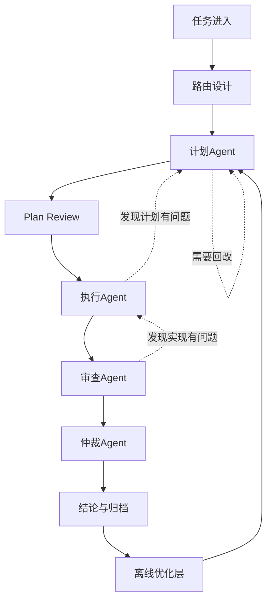

# 多智能体编排范式（讨论稿）

loop_id: LOOP-20260618-001-loop-skill
created_at: 2026-06-19T21:04:48+08:00
status: discussion_draft

## 目标

这份文档不是技能补丁，也不是执行报告。

它的目标是把我们现在讨论的“多智能体编排工作流”整理成一个可复用的范式，方便你拿去和其他线程继续讨论：

- 哪些工作适合拆成多个角色
- 哪些角色应该由谁负责
- 角色之间怎样交接
- 什么时候应该用 skill 升级流程
- 什么时候应该转成独立的编排项目

## 核心判断

我们要的不是一个“主 Agent 带着一堆工具干活”的模式。

我们要的是：

1. 任务先被路由
2. 每个 lane 只负责自己那一段
3. lane 之间直接交接
4. 交接以 artifact 为中心
5. 审查和仲裁独立存在
6. 历史经验通过 worklog、ledger、baton、review artifact 沉淀
7. SkillOpt 只负责离线优化，不负责接管 runtime 协议

## 范式总图



## 角色边界

### 计划Agent

负责定义路线、拆分任务、选择是否需要 Plan Review、决定是否要开更多 lane。

它输出的是计划，不是实现。

### 执行Agent

负责按已批准的计划改动文件、跑验证、记录证据、输出执行结果。

它不能重写计划，也不能把自己升格成总控。

### 审查Agent

负责只读审查执行结果，检查事实、范围、遗漏、风险和回归。

它的任务是找问题，不是帮执行写借口。

### 仲裁Agent

负责在计划、执行、审查出现冲突时做证据裁决，决定修复还是接受。

它不拥有“总经理”权力，只拥有裁决权。

### 经理Agent

负责历史回溯、状态恢复、任务索引、协同问题定位。

它是项目级状态角色，不是所有消息的中转站。

### 调度Agent

负责线程创建、消息投递、轮询状态、ledger 记录。

它是通信基础设施，不是规划、执行、审查、仲裁、经理。

### Claude

Claude 是 lane-owned 的外部视角。

它可以帮助计划、执行咨询、审查、仲裁，但不能由调度Agent代替 lane 去跑。

### SkillOpt / Sleep 层

SkillOpt 的角色不是实时编排，而是离线优化：

- 从历史 worklog / ledger / review / baton 中挖模式
- 生成候选 skill 或 protocol 修改
- 经过 held-out gate 再决定是否采纳

它属于“学会更好地编排”，不是“接管当前编排”。

## 交接规则

### 1. artifact-first

如果已经有完整的 plan.md、review.md、execution report 或类似正式 artifact，消息里只发：

- artifact 路径
- 读取要求
- 任务边界
- 退出条件

不要把完整正文重新展开、压缩改写或拆成碎片复述。

### 2. lane-to-lane direct handoff

默认交接顺序是：

```text
计划Agent -> 执行Agent -> 审查Agent -> 仲裁Agent
```

如果证据表明上游计划有问题，允许反向回传：

- 执行 -> 计划
- 审查 -> 执行
- 审查 -> 计划

### 3. message 可结构化，也可直接指向 artifact

消息可以是结构化信封，也可以是“信封 + artifact 路径”。

只要有完整 md 文档，就优先传路径，不要把正文拆开重述。

### 4. 可追溯 ID

每次 lane 间交接都应该有可追溯 ID，至少包括：

- loop_id
- message_id
- from_lane / to_lane
- from_thread / to_thread
- 物理投递者
- source_artifacts

## 状态层分离

这四个东西不能混：

### worklog

每个 Agent 的连续工作日志。

写它是为了记录“做了什么、踩了什么坑、证据在哪”。

### ledger

lane 间消息账本。

它记录的是“谁发给谁、什么时候发、发了什么类型的交接”。

### artifact

正式结论文件。

计划、执行报告、审查报告、仲裁、最终报告都属于 artifact。

### baton

恢复包。

它只在上下文快断、交接风险高、脏状态复杂、需要保留下一步命令时写。

它不是每一步都写的日志。

## 什么时候开哪些 lane

### 适合开多 lane 的情况

- 前后端联通或跨模块修改
- 需要浏览器验证、API 验证、文件系统验证
- 计划和实现容易分离
- 需要独立审查和证据裁决
- 任务风险高，回改成本大

### 不必开太多 lane 的情况

- 文档小修
- 配置小改
- 单文件机械修补
- 只需当前线程就能收口的轻任务

## 典型任务路由模板

### 前后端联通

```text
计划Agent
-> Plan Review
-> 执行Agent
-> 浏览器/接口审查
-> 仲裁Agent
```

### 视频剪辑类任务

```text
计划Agent
-> 检索Agent
-> 文案Agent
-> 剪辑Agent
-> 事实/版权审查Agent
-> 成片审查Agent
-> 仲裁Agent
```

### Skill / 规则更新

```text
计划Agent
-> Review
-> Execution
-> Review
-> 仲裁
```

### 小文档或配置修补

```text
当前线程 or 单一执行 lane
```

### 离线优化 / sleep 复盘

```text
历史会话 -> 经验提取 -> replay -> gate -> staged proposal -> review/adopt
```

## 当前 skill 与未来项目的边界

### 当前 `loop-engineering` 应该保留什么

- runtime lane 协议
- artifact-first handoff
- 角色边界
- 调度Agent 只是基础设施
- 经理Agent 只是状态与恢复角色
- worklog / ledger / artifact / baton 分离
- lane-owned Claude
- review / arbitration / reverse handoff

### 当前 `loop-engineering` 不应该塞什么

- 长篇 route 图册
- 视频剪辑等领域化流程全集
- 离线优化 runner 的完整实现
- 每个任务域的细碎操作模板

### 未来独立项目更适合做什么

- 动态路由设计器
- lane graph 生成器
- 离线睡眠式优化层
- 任务域策略库
- 经验采样与 gate 机制

## SkillOpt 的位置

SkillOpt 的意义是：

1. 把 skill 当作可训练状态
2. 把历史经验当作训练数据
3. 把 gate 当作采纳门槛
4. 把 staged proposal 当作安全缓冲

但它不应该直接取代 runtime 编排。

换句话说：

- 当前 skill 负责“怎么跑”
- 未来优化层负责“怎么越跑越好”

## 反模式

下面这些都不建议：

- 让 Dispatcher 成为所有消息的总中枢
- 让一个主 Agent 吞掉全部角色
- 把完整 artifact 再拆成短消息重写一遍
- 没有 worklog 就靠聊天记忆推进
- 没有 ledger 就无法追踪交接
- 没有 baton 就在上下文快断时硬扛
- 没有 gate 就直接把 protocol 修改采纳进 live skill

## 讨论问题

你可以拿这份文档去和其他线程继续讨论下面几个问题：

1. 哪些任务域应该默认开 lane graph？
2. 经理Agent 的边界要不要再收窄，只保留状态恢复？
3. 是否需要单独做一个“离线优化层”项目？
4. artifact-first 的硬规则要不要写进所有交接模板？
5. SkillOpt 的 gate 思路，应该以 reference 形式进入 skill，还是完全留到未来项目？

## 一句话结论

我们现在要的不是“一个更聪明的 Agent”，而是“一个可路由、可审查、可追溯、可离线优化的多智能体编排体系”。

